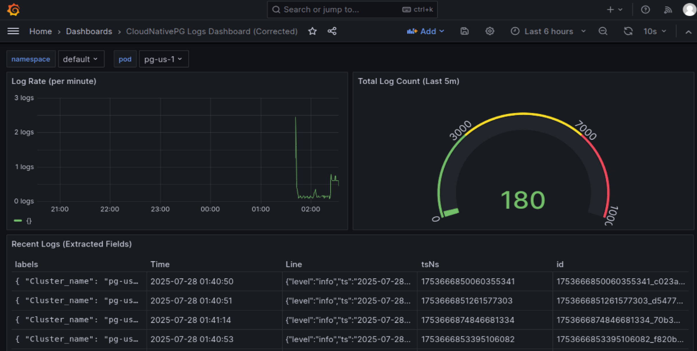

# Quickstart
<!-- SPDX-License-Identifier: CC-BY-4.0 -->

This section guides you through testing a PostgreSQL cluster on your local machine by
deploying CloudNativePG on a local Kubernetes cluster
using either [Kind](https://kind.sigs.k8s.io/) or
[Minikube](https://kubernetes.io/docs/setup/learning-environment/minikube/).

!!! Warning
    The instructions contained in this section are for demonstration,
    testing, and practice purposes only and must not be used in production.

Like any other Kubernetes application, CloudNativePG is deployed using
regular manifests written in YAML.

By following the instructions on this page you should be able to start a PostgreSQL
cluster on your local Kubernetes installation and experiment with it.

!!! Important
    Make sure that you have `kubectl` installed on your machine in order
    to connect to the Kubernetes cluster. Please follow the Kubernetes documentation
    on [how to install `kubectl`](https://kubernetes.io/docs/tasks/tools/install-kubectl/).

## Part 1: Setup the local Kubernetes playground

The first part is about installing Minikube or Kind. Please spend some time
reading about the systems and decide which one to proceed with.
After setting up one of them, please proceed with part 2.

We also provide instructions for setting up monitoring with Prometheus and
Grafana for local testing/evaluation, in [part 4](#part-4-monitor-clusters-with-prometheus-and-grafana)

### Minikube

Minikube is a tool that makes it easy to run Kubernetes locally. Minikube runs a
single-node Kubernetes cluster inside a Virtual Machine (VM) on your laptop for
users looking to try out Kubernetes or develop with it day-to-day. Normally, it
is used in conjunction with VirtualBox.

You can find more information in the official [Kubernetes documentation on how to
install Minikube](https://kubernetes.io/docs/tasks/tools/install-minikube) in your local personal environment.
When you installed it, run the following command to create a minikube cluster:

```sh
minikube start
```

This will create the Kubernetes cluster, and you will be ready to use it.
Verify that it works with the following command:

```sh
kubectl get nodes
```

You will see one node called `minikube`.

### Kind

If you do not want to use a virtual machine hypervisor, then Kind is a tool for running
local Kubernetes clusters using Docker container "nodes" (Kind stands for "Kubernetes IN Docker" indeed).

Install `kind` on your environment following the instructions in the [Quickstart](https://kind.sigs.k8s.io/docs/user/quick-start),
then create a Kubernetes cluster with:

```sh
kind create cluster --name pg
```

## Part 2: Install CloudNativePG

Now that you have a Kubernetes installation up and running
on your laptop, you can proceed with CloudNativePG installation.

Please refer to the ["Installation"](installation_upgrade.md) section and then proceed
with the deployment of a PostgreSQL cluster.

## Part 3: Deploy a PostgreSQL cluster

As with any other deployment in Kubernetes, to deploy a PostgreSQL cluster
you need to apply a configuration file that defines your desired `Cluster`.

The [`cluster-example.yaml`](samples/cluster-example.yaml) sample file
defines a simple `Cluster` using the default storage class to allocate
disk space:

```yaml
apiVersion: postgresql.cnpg.io/v1
kind: Cluster
metadata:
  name: cluster-example
spec:
  instances: 3

  storage:
    size: 1Gi
```

!!! Note "There's more"
    For more detailed information about the available options, please refer
    to the ["API Reference" section](cloudnative-pg.v1.md).

In order to create the 3-node PostgreSQL cluster, you need to run the following command:

```sh
kubectl apply -f cluster-example.yaml
```

You can check that the pods are being created with the `get pods` command:

```sh
kubectl get pods
```

That will look for pods in the default namespace. To separate your cluster
from other workloads on your Kubernetes installation, you could always create
a new namespace to deploy clusters on.
Alternatively, you can use labels. The operator will apply the `cnpg.io/cluster`
label on all objects relevant to a particular cluster. For example:

``` sh
kubectl get pods -l cnpg.io/cluster=<CLUSTER>
```

!!! Important
    Note that we are using `cnpg.io/cluster` as the label. In the past you may
    have seen or used `postgresql`. This label is being deprecated, and
    will be dropped in the future. Please use `cnpg.io/cluster`.

By default, the operator will install the latest available minor version
of the latest major version of PostgreSQL when the operator was released.
You can override this by setting the `imageName` key in the `spec` section of
the `Cluster` definition. For example, to install PostgreSQL 13.6:

```yaml
apiVersion: postgresql.cnpg.io/v1
kind: Cluster
metadata:
   # [...]
spec:
   # [...]
   imageName: ghcr.io/cloudnative-pg/postgresql:13.6
   #[...]
```

!!! Important
    The immutable infrastructure paradigm requires that you always
    point to a specific version of the container image.
    Never use tags like `latest` or `13` in a production environment
    as it might lead to unpredictable scenarios in terms of update
    policies and version consistency in the cluster.
    For strict deterministic and repeatable deployments, you can add the digests
    to the image name, through the `<image>:<tag>@sha256:<digestValue>` format.

!!! Note "There's more"
    There are some examples cluster configurations bundled with the operator.
    Please refer to the ["Examples" section](samples.md).

## Part 4: Monitor logs with Loki and Grafana

!!! Important
    Installing Loki and Grafana is beyond the scope of this project. The instructions in this section are provided for experimentation and illustration only.

In this section, we show how to deploy Loki and Grafana for log observability, and how to configure Promtail to collect logs from Kubernetes pods, including those scheduled on tainted nodes like PostgreSQL clusters.

We leverage the `loki-stack` Helm chart, which is maintained by the Grafana community. Please refer to the project documentation for additional background and advanced usage.

The `loki-stack` chart installs the following components:

- **Loki**: log aggregation and query backend
- **Promtail**: log collection agent that scrapes logs from pods
- **Grafana**: visualization interface

We provide a configuration file that enables persistence for Loki, predefined Grafana settings, and Promtail parsing logic for structured logs.

---

### Installation

If you don't have Helm installed yet, please follow the instructions on the [Helm website](https://helm.sh/docs/intro/install/) to install it on your system.

We begin by adding the Grafana Helm repository and updating the chart information:

```bash
helm repo add grafana https://grafana.github.io/helm-charts
helm repo update
```
Now deploy the Loki, Grafana, and Promtail stack using our custom configuration:

```yaml
loki:
  enabled: true
  isDefault: true
  persistence:
    enabled: true
    size: 10Gi

grafana:
  enabled: true
  adminUser: admin
  adminPassword: admin
  service:
    type: ClusterIP
  sidecar:
    dashboards:
      enabled: true
    datasources:
      enabled: true

promtail:
  enabled: true
  tolerations:
    - key: "node-role.kubernetes.io/postgres"
      operator: "Exists"
      effect: "NoSchedule"
  config:
    snippets:
      pipeline_stages:
        - cri: {}        # Parses container runtime log format
        - json:          # Parses structured JSON logs
            expressions:
              level: level
              msg: msg
              logger: logger
```
We can accomplish this with the following commands:
``` sh

helm upgrade --install \
  -f https://raw.githubusercontent.com/J-yur/cloudnative-pg/main/docs/src/samples/monitoring/loki-grafana.yaml \
  loki-logs grafana/loki-stack \
  --namespace monitoring --create-namespace
```
After completion, you will have:
- **Loki** with persistent storage enabled
- **Promtail** with taint tolerations and JSON log parsing enabled
- **Grafana** with default login credentials

### Grafana Dashboard

In our installation so far, Grafana is deployed with no predefined dashboards.

To open Grafana, you can port-forward the grafana service:

``` sh
kubectl port-forward svc/loki-logs-grafana 3000:80 -n monitoring

```

and access Grafana locally at [`http://localhost:3000/`](http://localhost:3000/)
providing the credentials `admin` as username and password
(as defined in our config file earlier).

Here is a dashboard I created to visualize the logs collected by Loki:


